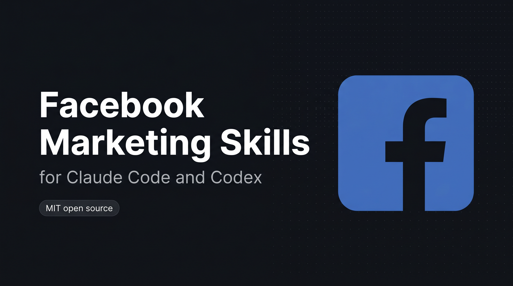

<p align="center">
  
</p>

# Facebook Marketing Skills for Claude Code and Codex

<p align="center">
  
  
  
  
  
  
  
</p>

> **Part of the [linkedin-skills](https://github.com/sergebulaev/linkedin-skills) family (400+ stars).** Same voice engine and approve-before-publish flow, now for Facebook. Also available for [Instagram](https://github.com/sergebulaev/instagram-skills) · [X](https://github.com/sergebulaev/x-skills) · [YouTube](https://github.com/sergebulaev/youtube-skills) · [TikTok](https://github.com/sergebulaev/tiktok-skills) · [Threads](https://github.com/sergebulaev/threads-skills).

**8 skills that turn Claude Code and Codex into your Facebook Page content team.** They write and audit Page posts in your voice, lean into the under-80-character engagement sweet spot, read the comments on your posts, and plan a week of content. Every draft gets the AI tells stripped and waits for your approval before anything publishes. No coding required.

Once installed, just ask Claude Code or Codex things like:

- "Write a Facebook Page post about [topic]"
- "Plan a week of Page content for my [business]"
- "Read the comments on this post (reads real data via Apify)"
- "Rewrite this so it doesn't sound like AI"

The right skill activates automatically. Then you review and approve.

## Install

Pick whichever way you use Claude Code or Codex:

### Codex CLI

```bash
codex plugin marketplace add sergebulaev/facebook-skills
codex plugin add facebook-skills@facebook-skills
```

To test a local clone before publishing changes:

```bash
git clone https://github.com/sergebulaev/facebook-skills.git
cd facebook-skills
codex plugin marketplace add .
codex plugin add facebook-skills@facebook-skills
```

### claude.ai (web)

1. Open https://claude.ai/code
2. Go to **Skills** in the sidebar
3. Click **Add from GitHub**
4. Paste: `sergebulaev/facebook-skills`
5. Done. The skills activate automatically when you ask about Facebook Pages.

### Claude Desktop (Mac / Windows)

1. Open Claude Desktop
2. Open **Settings** (gear icon)
3. Go to **Skills**
4. Click **Add from GitHub**
5. Paste: `sergebulaev/facebook-skills`
6. Done. Start a new conversation and ask Claude to write a Page post.

### Claude Code (CLI / VS Code / JetBrains)

```
/plugin marketplace add sergebulaev/facebook-skills
/plugin install facebook-skills@facebook-skills
```

Or clone the repo and open it as your working directory:

```bash
git clone https://github.com/sergebulaev/facebook-skills.git
cd facebook-skills
```

### OpenClaw

1. Open your OpenClaw working directory
2. Clone the skills into it:
   ```bash
   git clone https://github.com/sergebulaev/facebook-skills.git
   ```
3. In OpenClaw settings, add this to your system prompt:
   ```
   You have Facebook marketing skills in ./facebook-skills/.
   For any Facebook task, read the relevant skills/*/SKILL.md first.
   Use lib/url_parser.py for URL parsing and lib/publora_client.py for publishing.
   ```
4. Done. Ask OpenClaw to write a Facebook post.

### Hermes Agent

Hermes Agent (Nous Research) follows the agentskills.io open standard and loads `skills/*/SKILL.md` directly. Clone the bundle into your Hermes skills folder:

```bash
git clone https://github.com/sergebulaev/facebook-skills.git ~/.hermes/skills/facebook-skills
```

Coming from OpenClaw? `hermes claw migrate` imports these skills automatically. Then call `/<skill-name>` from any of your Hermes chat surfaces.

### Any agent (skills CLI)

One command that works across Claude Code, Codex, Cursor, and any other agent that reads SKILL.md files:

```bash
npx skills add sergebulaev/facebook-skills
```

## What you can do

Once installed, just ask Claude Code or Codex for help with your Facebook Page. The right skill activates automatically.

**Write a short Page post:**
> "Write a short punchy Facebook Page post about our new weekend hours. Keep it under 80 characters."

**Write a longer story post:**
> "Turn these notes into a story post about why we rebuilt the product three times."

**Check a draft before posting:**
> "Audit this Page post for AI tells and the under-80 sweet spot: [paste your text]"

**Reverse-engineer a high-share post:**
> "What hook does this Page post use? https://www.facebook.com/SomePage/posts/123 (I'll paste the text)"

**Reply to comments on your Page:**
> "Draft replies to these comments on my latest Page post: [paste the comments]"

**Plan your week:**
> "Plan a week of Facebook Page content. We're a local bakery launching a new menu."

Every skill shows you a draft first and waits for your OK. Nothing gets posted without your approval.

## The 8 skills

| Skill | What it does |
|---|---|
| **Post Writer** | Drafts a short punchy Page post (favoring the under-80-char engagement sweet spot) or a longer story post, using a 2026 Facebook hook formula picked by goal: shares, comments, or reactions. Runs the humanizer pass before showing you the draft |
| **Repurposer** | Turns a LinkedIn post, X thread, blog, or newsletter into a native Page post: warms the tone, leads with a standalone claim above the "See more" fold, moves links to the first comment, and strips off-platform artifacts. Transforms, never copy-pastes |
| **Humanizer** | Strips em dashes, AI vocabulary ("leverage", "delve", "harness"), "We are thrilled to announce" openers, rule-of-three lists, and corporate auto-pilot. Bundles a `--mode audit` pre-publish check (under-80 sweet spot, hook, engagement bait, hashtag and emoji limits) |
| **Hook Extractor** | Reverse-engineers the hook from any high-share Page post. Maps it to one of the 10 Facebook formulas and returns a blank template you can fill |
| **Engagement Drafter** | Drafts replies to comments on your Page's posts in your voice. Publora has no Facebook comment endpoint, so the drafts come back as a copy-paste block to post in Facebook or Meta Business Suite |
| **Content Planner** | Creates a weekly Page plan with a short-to-story post mix, per-day hooks, posting times, a share-optimized goal balance, and a daily comment-reply target |
| **Page Optimizer** | Audits and rewrites the Page itself for 2026: Page name, username and vanity URL, profile picture and cover photo, Intro/About and category, the CTA button matched to your goal (Shop, Book, Sign Up, Contact), pinned post, tabs order, and contact/link fields. Turns a default Page into one that converts a visitor into a follower or a lead |
| **Audience Insights** | Reads a Page and its audience from real data (via Apify, no login): pulls any Page's public stats (followers, likes, category, intro) for you or a competitor, and pulls the commenters on a public post. Facebook hides who reacted or liked, so commenters are the engagement signal |

## How posting works on a Facebook Page

Facebook Pages allow **text-only, photo, link, and video posts** (text-only is fully supported, unlike Instagram, TikTok, or YouTube). The single highest-engagement move is the **short post**: posts under 80 characters get a reported ~66% more engagement. So these skills lead with short, punchy lines and only reach for a longer story post when the material earns it.

Posting to a Page on the native Facebook Graph API means setting up a Meta Developer app, handling OAuth, managing 59-day page tokens, and tracking Graph API versioning. This bundle hands all of that to [Publora](https://publora.com): one `create-post` call publishes to your Page, and you can post to several Pages at once.

## Optional: auto-post with Publora

By default, the skills draft content for you to copy-paste into your Facebook Page. If you want Claude Code or Codex to publish Page posts directly, connect Publora. It takes about 2 minutes.

### What is Publora?

[Publora](https://publora.com) is a publishing API that turns one `create-post` call into a Facebook Page post (and can cross-post the same content to LinkedIn, Instagram, X, Threads, and more), without you touching the Facebook Graph API.

### Setup (2 minutes)

**Step 1.** Sign up at https://app.publora.com/signup (free)

**Step 2.** Connect your Page: click **Channels** in the left sidebar, then **Add Channel**, pick **Facebook**, and authorize the **Page** (not a personal profile).

**Step 3.** Find your Platform ID: go to **Channels**, click your Facebook Page. The ID looks like `facebook-112233445566`. Copy the whole thing including `facebook-`. Each Page you manage has its own id.

**Step 4.** Get your API key: click **Settings** (gear icon, bottom-left), then **API**, then **Create Key**. Copy the `sk_...` string.

**Step 5.** Create a file called `.env` in the facebook-skills folder:

```
PUBLORA_API_KEY=sk_paste_your_key_here
FACEBOOK_PLATFORM_ID=facebook-paste_your_page_id_here
```

If you cloned the repo, copy the template instead:

```bash
cp .env.example .env
```

Then open `.env` and replace the placeholders with your real values.

**Step 6.** Install two small Python packages:

```bash
pip install requests python-dotenv
```

**Step 7.** Test it. Ask Claude Code or Codex:

> "Schedule a test Page post via Publora 24 hours from now: 'testing the API connection, will cancel in dashboard'."

If Publora returns a `postGroupId`, you're set. Cancel the post in the Publora dashboard before the scheduled time. If you get HTTP 401, your API key is wrong. If you get an `Invalid platform ID format` error, your `FACEBOOK_PLATFORM_ID` is wrong. See [Troubleshooting](#troubleshooting).

> **Note on comment replies:** Facebook has no comment endpoint on Publora, so the Engagement Drafter always returns its drafts as a copy-paste block for you to post as replies yourself. Page posts auto-publish.

## Voice rules

Every skill follows these rules automatically:

1. No em dashes. Biggest AI tell in 2026.
2. Capitalize names. Always. Lowercase a brand reads as careless.
3. No AI vocabulary: "leverage", "fundamentally", "streamline", "harness", "delve", "unlock", "foster".
4. No "We are thrilled to announce" or corporate auto-pilot openers.
5. Specific numbers beat adjectives. "2.4x" beats "way better".
6. Lead short. Under 80 chars is the engagement sweet spot. The first line carries the post (Facebook folds longer posts behind "See more").
7. Design for a share or a comment, not just a passive Like. 0-2 hashtags, 0-2 emoji.

## Troubleshooting

| Problem | Fix |
|---|---|
| Skills don't activate when I ask about Facebook | Make sure you installed via the Skills panel, `/plugin install`, or `codex plugin add`. Try a new conversation. |
| "PUBLORA_API_KEY not set" | Your `.env` file is missing or in the wrong folder. It should be in the `facebook-skills/` root. |
| "401 Invalid API key" from Publora | Your API key is wrong or revoked. Go to Publora Settings > API > Create a new key. |
| "Invalid platform ID format" | Your `FACEBOOK_PLATFORM_ID` is wrong. Go to Publora Channels and copy the full `facebook-...` string. |
| Posts suddenly stopped publishing | Facebook page tokens last 59 days. Publora auto-refreshes them, but if a refresh fails (e.g. a permission change), reconnect the Page in the Publora dashboard. |
| My comment reply didn't auto-post | Facebook has no comment endpoint on Publora by design. The Engagement Drafter returns a copy-paste block. Post it yourself in Facebook or Meta Business Suite. |
| My post reached fewer people than expected | Link posts suppress organic reach. Try a native text, photo, or video post, and lead with a short line. |
| `pip install` fails | Use a virtual environment: `python -m venv venv && source venv/bin/activate && pip install requests python-dotenv` |

## Cross-cutting references

- [`references/hook-formulas.md`](references/hook-formulas.md) - the 10 Facebook hook formulas with skeletons and goal tags
- [`references/algorithm-heuristics.md`](references/algorithm-heuristics.md) - 2026 Facebook Page ranking signals, the under-80 boost, timing, and limits
- [`references/voice-rules.md`](references/voice-rules.md) - the canonical voice rules every skill inherits

---

<details>
<summary><b>For developers: runtime compatibility, URL parsing, and internals</b></summary>

## Runtime compatibility

```
facebook-skills/
  skills/             SKILL.md frontmatter; native to Claude Code and Codex, others read as markdown
  .codex-marketplace/ generated nested Codex package (run scripts/sync_codex_marketplace.py)
  lib/                pure Python, works in any agent runtime
  references/         pure markdown, works anywhere
  scripts/            pure Python CLI, works anywhere
```

| Runtime | Auto-discovers skills? | Setup |
|---|---|---|
| **Claude Code** (CLI, Desktop, Web, IDE) | Yes | Install via plugin or clone. Skills activate on matching prompts. |
| **Codex CLI** | Yes | `codex plugin marketplace add sergebulaev/facebook-skills` and `codex plugin add facebook-skills@facebook-skills`. |
| **Anthropic Managed Agents** (`/v1/agents`) | Yes | Pass skill files in the agent context. |
| **Cursor / Cline / Aider** | Manual | Read `SKILL.md` files as prompt context; import `lib/` as Python. |
| **LangChain / AutoGen** | No | Use `lib/` as a package; feed `references/` as prompt context. |

## Generic Python agent quickstart

```python
import sys; sys.path.insert(0, "path/to/facebook-skills")
from lib import parse_facebook_url, PubloraClient, publish

parsed = parse_facebook_url("https://www.facebook.com/Stripe/posts/123456789012345")
print(parsed["page"], parsed["post_id"])  # Stripe 123456789012345

# Write side (Publora) - a Facebook Page post (short or long)
client = PubloraClient()  # reads PUBLORA_API_KEY from env
client.create_post(
    content="We shipped it. 3 years of work, live today.",
    platforms=["facebook-112233445566"],
)

# Or use the high-level wrapper that handles manual / Publora / diy routing
publish("post", draft_text="...", target_url="https://www.facebook.com/YourPage",
        platforms=["facebook-112233445566"])
```

## URL handling

`lib/url_parser.py` parses Facebook Page post and profile URLs across their many shapes:

| URL fragment | Parsed |
|---|---|
| `facebook.com/PAGE/posts/ID` | `{page, post_id, url_type: "post"}` |
| `facebook.com/permalink.php?story_fbid=ID&id=PAGEID` | `{post_id, page, url_type: "post"}` |
| `facebook.com/watch/?v=ID` | `{post_id, url_type: "post"}` |
| `facebook.com/share/p/TOKEN/` | `{share_token, url_type: "share"}` (ids hidden) |
| `facebook.com/PAGE` | `{page, url_type: "profile"}` |
| `fb.com/PAGE` | normalized to www.facebook.com |

```bash
python lib/url_parser.py "https://www.facebook.com/Stripe/posts/123456789012345"
```

## Why comment replies are copy-paste

Publora's comment and reaction endpoints are LinkedIn-only, and `create-post` only creates Page posts, not comment replies. So the Engagement Drafter drafts the reply text and hands it back as a copy-paste block for you to post in Facebook or Meta Business Suite. Page posts auto-publish through Publora normally.

</details>

## References

- [Publora API docs](https://docs.publora.com) - endpoint reference for the publishing layer
- [Meta for Developers: Pages API](https://developers.facebook.com/docs/pages-api/) - the underlying Graph layer Publora wraps

## License

MIT. Powered by [Publora](https://publora.com).

## Related open-source skill bundles

Part of a family of AI social-media marketing skill bundles for Claude Code and Codex:

- [linkedin-skills](https://github.com/sergebulaev/linkedin-skills) - LinkedIn
- [x-skills](https://github.com/sergebulaev/x-skills) - X (Twitter)
- [instagram-skills](https://github.com/sergebulaev/instagram-skills) - Instagram
- [youtube-skills](https://github.com/sergebulaev/youtube-skills) - YouTube
- [threads-skills](https://github.com/sergebulaev/threads-skills) - Threads
- [tiktok-skills](https://github.com/sergebulaev/tiktok-skills) - TikTok
- **facebook-skills - Facebook Pages (this repo)**

Also: [Anthropic Skills repo](https://github.com/anthropics/skills), the `awesome-claude-skills` directory.
